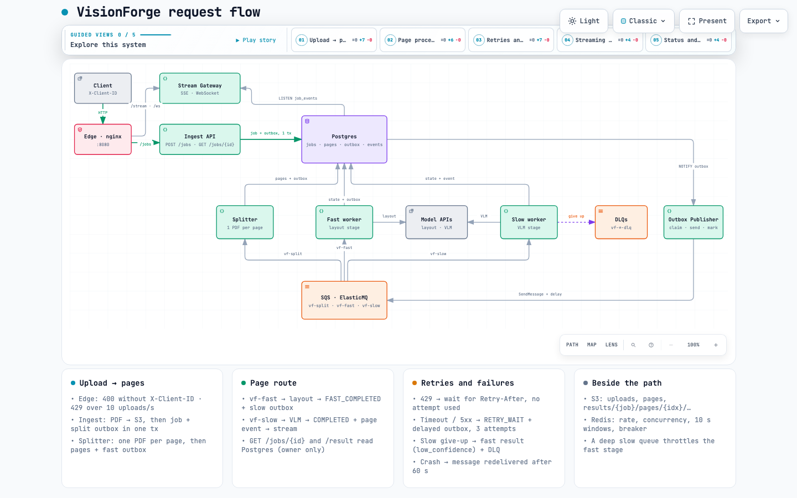
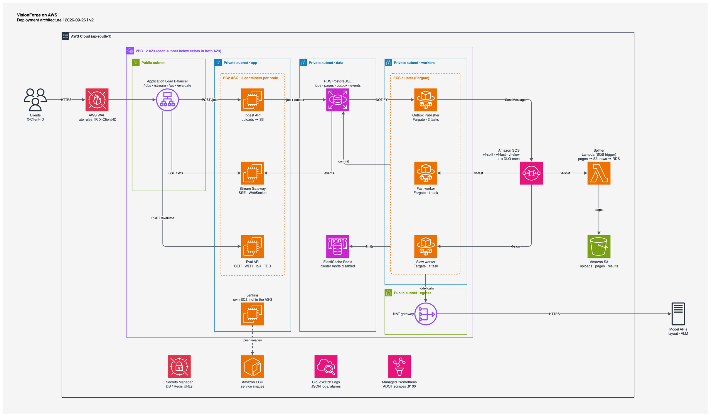

# Architecture Overview

A living guide for agents and engineers: what VisionForge is, how a request moves through it, where the code lives, and how to run and test it.

**In one paragraph:** VisionForge is a high-throughput OCR pipeline orchestrator. Customers upload multi-page documents (up to 100 pages / 100 MB). Each page goes through a layout model (50 ms, 100 RPS) and then a VLM (1.5–3 s, 10 RPS). Results stream back out of order with sequencing headers, so clients can reassemble the document. Postgres is the source of truth. A transactional outbox feeds SQS queues. Each stage has one worker, which adapts its request rate and concurrency to 429s, latency and errors. A deep VLM queue throttles the layout stage. A separate stateless API scores extracted trees against ground truth (CER/WER, IoU, tree edit distance).

## 1. Project Structure

One Python monorepo and one Docker image. Each service is a different entrypoint of that image.

```
VisionForge/
├── services/                     # Deployable services (one entrypoint each)
│   ├── ingest_api/app.py         # POST /jobs, GET /jobs/{id}, GET /jobs/{id}/result
│   ├── stream_gateway/           # SSE + WebSocket result streams (app.py, broker.py)
│   ├── eval_api/app.py           # POST /evaluate: CER/WER, IoU, tree edit distance
│   ├── outbox_publisher/main.py  # Postgres outbox rows → SQS
│   ├── splitter/main.py          # vf-split consumer: one single-page PDF per page
│   ├── worker/                   # Layout worker and VLM worker (VF_STAGE=fast → layout, slow → VLM)
│   │   ├── main.py               #   admission, model call, outcome handling, give-up/fallback
│   │   ├── clients.py            #   model HTTP client (Idempotency-Key, Retry-After)
│   │   └── stages.py             #   result shaping, fallback result, idempotency keys
│   └── mock_models/app.py        # Mock layout / VLM endpoints with runtime chaos knobs (local only)
├── libs/vf_common/               # Shared library used by every service
│   ├── config.py                 # Settings (VF_* env vars) and per-model limits (MODELS)
│   ├── models.py                 # Pydantic schemas: DocNode, PageResult, job/page statuses
│   ├── repo.py                   # All SQL: conditional state transitions + outbox rows
│   ├── migrations/001_init.sql   # Database schema
│   ├── db.py                     # asyncpg pool (JSON codecs) and migration runner
│   ├── queues.py                 # SQS access (ElasticMQ locally)
│   ├── storage.py                # S3 access; pipelined multipart upload
│   ├── errors.py                 # Error classification and retry timing
│   ├── ratelimit/                # Adaptive limits (see §6)
│   │   ├── controller.py         #   pure rules: window verdicts, hysteresis, layout admission
│   │   ├── limits.py/.lua        #   Redis token bucket, concurrency slots, windows, retry budget
│   │   └── breaker.py/.lua       #   Redis circuit breaker
│   ├── evaluation.py             # CER/WER (bit-parallel Levenshtein), IoU matching, Zhang–Shasha TED (see §7)
│   ├── envelope.py               # Stream frame header: seq, watermark, window bitmap
│   ├── documents.py              # Page counting (PDF / TIFF)
│   └── metrics.py                # Prometheus metrics and JSON logging
├── client/cli.py                 # Reference client: submit, stream, reorder buffer, resume
├── scripts/                      # Load, chaos and demo tools (see §10)
├── tests/
│   ├── unit/                     # 81 tests, no infrastructure needed
│   └── integration/              # 21 against Postgres + ElasticMQ, 8 end-to-end against the stack
├── deploy/
│   ├── docker-compose.yml        # Local stack (every service has a mem_limit)
│   ├── nginx.conf                # Edge: routes, rate and connection limits
│   ├── prometheus.yml, grafana/  # Metrics scrape config and the "VisionForge pipeline" dashboard
│   └── terraform/main.tf         # AWS infrastructure (out of date: describes the previous design)
├── docs/diagrams/                # Request-flow and AWS deployment diagrams (see §2)
├── postman/                      # Postman collection for the HTTP APIs
├── reports/                      # Saved outputs of test runs (see §10 for which are current)
├── Dockerfile, Makefile, pyproject.toml, uv.lock
├── README.md                     # Overview and quick start
└── architecture.md               # This document
```

## 2. High-Level System Diagram

**Request flow diagram** ([interactive HTML](docs/diagrams/request-flow.html), [source spec](docs/diagrams/request-flow.architecture.json)). The HTML has five guided views, one per route: upload, page processing, retries and failures, streaming, and reads and evaluation.



**AWS deployment diagram** ([draw.io source](docs/diagrams/aws-architecture.drawio), [guide](docs/diagrams/aws-architecture.md)):



**Rules every change must keep:**
- **Outbox atomicity.** Every state change that creates work inserts its `outbox_events` row in the same transaction. There is never committed state with a lost message.
- **Idempotent consumers.** Page transitions are conditional on the expected `stage` and `status`. A duplicate or stale message changes zero rows and is dropped. Delivery is at least once.
- **Delete (ACK) the message only after commit.** A crashed worker's message reappears after its 60 s visibility timeout.
- **Idempotent model calls.** `Idempotency-Key = sha256(job:page:model:version)`. A call in flight when a worker died replays the cached result instead of running inference again.
- **Deterministic results.** Results go to `results/{job}/pages/{idx:04d}/{fast,slow,final}.json` (layout, VLM and final result), so rewriting them is harmless.
- **Ordered streams.** Stream `seq` is gap-free per job, allocated in the transaction that completes the page.

## 3. Core Components

There is no web UI: customers call the HTTP API directly, identified by an `X-Client-ID` header. Reference clients are listed in §10.

All services are Python 3.12 asyncio, share `libs/vf_common`, log JSON to stdout, and expose Prometheus metrics (HTTP services at `/metrics`, background services on `:9100`).

### 3.1. Edge

Name: Edge (nginx locally; ALB + AWS WAF on AWS).

Description: The single entry point, [deploy/nginx.conf](deploy/nginx.conf):
- **Routing:** `/jobs` goes to ingest, `/jobs/*/stream` and `/ws` to the stream gateway, and `/evaluate` to the eval API.
- **Client ID:** requests without `X-Client-ID` get 400.
- **Rate and connection limits:** uploads, streams and `/evaluate` each have per-IP and per-client limits, listed in §6.1.
- **Body size:** 100 MB (5 MB for `/evaluate`).
- **Buffering:** uploads and SSE pass through unbuffered.

Technologies: nginx 1.27.

Deployment: compose service `edge` on port 8080. On AWS: ALB with path rules, plus WAF rate-based rules. WAF counts over windows of a minute or more and has no concurrent-connection limit.

### 3.2. Ingest API

Name: Ingest API ([services/ingest_api/app.py](services/ingest_api/app.py)).

Description: `POST /jobs` handles an upload:
1. It checks the content type (PDF, TIFF, PNG or JPEG) and size.
2. It streams the body to S3 and to a temp file. The S3 upload is pipelined; see §6.3.
3. It counts the pages, rejecting unreadable documents or more than 100 pages with 422.
4. In one transaction it inserts the job and a `split` outbox row, then returns 202 with `job_id`, `request_id`, `total_pages` and `stream_url`.

It accepts a well-formed `X-Request-ID` or generates one, and stores it on the job as the correlation ID for everything that follows (§9).

A 100 MB upload takes about 0.7 s.

It also serves `GET /jobs/{id}` (status and per-status page counts) and `GET /jobs/{id}/result` (page results in document order). Both are scoped to the owning client, so any other `X-Client-ID` gets 404.

Technologies: FastAPI, aioboto3, asyncpg, pikepdf, Pillow.

Deployment: compose `ingest-api`. On AWS: a container on the EC2 Auto Scaling group behind the ALB.

### 3.3. Stream Gateway

Name: Stream Gateway ([services/stream_gateway/](services/stream_gateway/)).

Description: `GET /jobs/{id}/stream` (SSE; resume with `Last-Event-ID`) and `/jobs/{id}/ws` (WebSocket; `?client_id=&last_event_id=`). Each subscriber reads the durable `events` table from its own cursor, 64 events at a time. A `NOTIFY job_events` only wakes it, so it holds no buffers, and restarts or reconnects lose nothing. It sends a heartbeat every 15 s. The frame envelope carries `seq` (gap-free per job), `watermark` (every page below it has been emitted) and a `window` bitmap.

Technologies: FastAPI, asyncpg `LISTEN`.

Deployment: compose `stream-gateway`. On AWS: a container on the same ASG nodes. It connects to RDS directly, not through a pooling proxy, because `LISTEN` needs a dedicated session.

### 3.4. Eval API

Name: Eval API ([services/eval_api/app.py](services/eval_api/app.py), metrics in [libs/vf_common/evaluation.py](libs/vf_common/evaluation.py)).

Description: `POST /evaluate {predicted, ground_truth, iou_threshold?}` compares two `DocNode` trees and returns `text`, `bbox`, `tree` and `timings_ms`:
- **CER/WER:** Levenshtein distance between the reading-order text streams, divided by the ground truth's length.
- **IoU:** each predicted box is matched to at most one ground-truth box on the same page, greedily by highest IoU. The response has mean IoU, precision / recall / F1 at the threshold, and type accuracy.
- **TED:** Zhang–Shasha tree edit distance on node types. §7 covers the algorithm, its complexity and the limits. A 50-node diff takes 0.4–9.5 ms; the requirement is under 100 ms.

The handler is a plain function, so FastAPI runs it in a worker thread and the event loop stays free.

Technologies: FastAPI, Pydantic. Pure Python, no extra dependencies.

Deployment: compose `eval-api`. On AWS: its own container on the ingest ASG nodes, with a CPU cap so heavy evaluation can't slow uploads on the same node.

### 3.5. Outbox Publisher

Name: Outbox Publisher ([services/outbox_publisher/main.py](services/outbox_publisher/main.py)).

Description: moves committed outbox rows to SQS (§5.1):
- **Claim:** up to 100 unsent rows at a time (`FOR UPDATE SKIP LOCKED`, so several publishers are safe).
- **Send:** to SQS with the row's `delay_s`.
- **Mark:** sets them sent and moves their pages to `*_QUEUED`, in the same transaction.
- **Wake-up:** `NOTIFY outbox` wakes it; otherwise it polls every 10 s.

Technologies: asyncpg, aioboto3.

Deployment: compose `outbox-publisher`. On AWS: ECS Fargate with 2 tasks. It's on the critical path; alarm on `vf_outbox_oldest_seconds`.

### 3.6. Splitter

Name: Splitter ([services/splitter/main.py](services/splitter/main.py)).

Description: consumes `vf-split`:
- **Split:** spools the upload to disk and writes one single-page PDF per page to `pages/{job}/{idx:04d}.pdf`.
- **Commit:** in one transaction, inserts the pages and their outbox rows for the layout queue.
- **Failures:** a document that can't be read fails its job. One that keeps crashing the splitter is failed after 3 deliveries.

Technologies: pikepdf (qpdf), Pillow.

Deployment: compose `splitter`. On AWS: Lambda with an SQS trigger. The handler adapter isn't written yet.

### 3.7. Layout and VLM Workers

Name: Layout worker and VLM worker ([services/worker/main.py](services/worker/main.py)). One image; `VF_STAGE=fast` runs the layout worker and `VF_STAGE=slow` the VLM worker.

Description: one worker per stage (no locks). A message is received only when admission allows it (§6). For each page the worker:
1. marks the page as processing (§5.3);
2. waits for a token from the shared bucket;
3. calls the model with an idempotency key;
4. acts on the outcome, and deletes the message only after committing.

| Outcome | Examples | Action |
|---|---|---|
| ok | 2xx | Write the result to S3; commit the next state |
| throttled | 429 | Freeze the token bucket until `Retry-After`; retry without using an attempt |
| retry | timeout, 408, 5xx | `RETRY_WAIT` plus a delayed outbox row, full-jitter backoff (`uniform(0, min(60, 2^attempt))` s), 3 attempts |
| auth | 401, 403 | Trip the breaker; retry after it cools down, without using an attempt |
| permanent | 400, 404 | Give up |

**Giving up:**
- The layout worker passes the page on to the VLM without layout hints; a page with bad input fails.
- The VLM worker falls back to the layout result (`low_confidence`, confidence below 0.5), or fails the page if there's no layout result.

Given-up pages are copied to the stage's DLQ.

Technologies: httpx, redis-py with Lua scripts, aioboto3, asyncpg.

Deployment: compose services `fast-worker` (layout) and `slow-worker` (VLM), one replica each. On AWS: ECS Fargate with exactly 1 task each, `minimumHealthyPercent 0` / `maximumPercent 100` (stop the old task before starting the new), and `stopTimeout` about 60 s (workers drain for up to 30 s).

### 3.8. Mock Models (local only)

Name: mock-layout / mock-vlm ([services/mock_models/app.py](services/mock_models/app.py)).

Description: stand-ins for the model APIs. Layout takes 50 ms, allows 100 RPS and fails 2% of calls. The VLM takes 1.5–3 s, allows 10 RPS and fails 5%.
- **Load-sensitive latency:** above `capacity` concurrent requests, every request slows in proportion to the overload.
- **Idempotency cache in Redis:** successful responses are cached per key, and concurrent duplicates join the in-flight call.
- **`/admin/chaos`:** changes `rps_limit`, `capacity`, `latency_multiplier`, `failure_rate`, `error_status` and `outage` at runtime. `/admin/stats` and `/admin/reset` are also available.

Technologies: FastAPI, Redis.

Deployment: compose only (ports 8081 and 8082). In production, point `VF_LAYOUT_URL` and `VF_VLM_URL` at the real models.

## 4. Data Stores

### 4.1. PostgreSQL

Name: Primary database, the source of truth.

Type: PostgreSQL 16 (RDS on AWS).

Purpose: job and page state, the outbox, the durable stream log, and a record of every model call. Schema: [001_init.sql](libs/vf_common/migrations/001_init.sql); all SQL is in [repo.py](libs/vf_common/repo.py).

Key Schemas/Collections:

| Table | Holds |
|---|---|
| `clients` | One row per customer |
| `jobs` | `status`, `total_pages`, `next_seq` (the stream sequence counter) |
| `pages` | Per page: `status`, `stage`, attempt counts, `source`, `low_confidence` |
| `outbox_events` | `queue`, `payload`, `delay_s`, `sent_at` |
| `model_attempts` | Every model call: outcome, HTTP status, latency |
| `events` | Stream log: `job_id`, `seq`, `kind`, envelope |

Triggers `NOTIFY job_events` and `NOTIFY outbox`. The job and page state machines are in §5.

### 4.2. Redis

Name: Shared limiter and breaker state.

Type: Redis 7 (ElastiCache on AWS, cluster mode disabled: the Lua scripts touch two keys at once).

Purpose: per-model adaptive limits (§6.2). It holds state rather than locks, so limits survive a worker restart. Keys:

| Key | Holds |
|---|---|
| `ctl:<stage>` | Current limits, streaks, and the last judged window |
| `win:<stage>:<window>`, `lat:<stage>:<window>` | 10 s outcome counters and latencies |
| `bucket:<stage>` | Token bucket |
| `slots:<stage>` | Concurrency slots |
| `brk:<model>`, `brk:<model>:win` | Circuit breaker |
| `mock:<model>:*` | The mocks' idempotency cache |

### 4.3. S3

Name: Object storage.

Type: SeaweedFS locally (S3 API); Amazon S3 on AWS.

Purpose:

| Key | Holds |
|---|---|
| `uploads/{client}/{job}` | Original upload |
| `pages/{job}/{idx:04d}.pdf` | Single-page PDFs |
| `results/{job}/pages/{idx:04d}/{fast,slow,final}.json` | Layout result, VLM result and final result |

Services use only the plain S3 API through aioboto3.

### 4.4. SQS

Name: Work queues.

Type: ElasticMQ locally (SQS API, in memory); Amazon SQS on AWS.

Purpose: `vf-split`, `vf-fast` (layout) and `vf-slow` (VLM), each with a DLQ. §5.1 covers the topology and delivery settings. Locally, restarting the `sqs` container loses queued messages. Postgres keeps the state, but those pages would stay `*_QUEUED` because nothing re-publishes them.

## 5. Queue & State Machine Design

### 5.1. Queue topology

Work moves as a loop between Postgres and SQS. Every step is one transaction that changes state and writes the outbox row for the next step:

```
state change + outbox row (1 tx) ─NOTIFY─► outbox publisher ─► SQS queue ─► consumer
      ▲                                                                        │
      └──────────── next state change + next outbox row (1 tx), then delete ───┘
```

| Queue | Outbox row written by | Consumer | Message body |
|---|---|---|---|
| `vf-split` | Ingest (job accepted) | Splitter | `{job_id, request_id}` |
| `vf-fast` | Splitter (pages created); layout worker (its own retries) | Layout worker | `{job_id, idx, request_id}` |
| `vf-slow` | Layout worker (page done or given up); VLM worker (its own retries) | VLM worker | `{job_id, idx, request_id}` |
| `vf-*-dlq` | Workers (copy of a given-up page); SQS redrive after 5 receives | Nobody; for inspection | as above, plus `reason` |

**Why an outbox:** a database commit and an SQS send can't be one atomic operation. Writing the message as a row in the same transaction, and publishing it afterwards, means state and work can never disagree.

**Delivery semantics:**
- **At least once.** The publisher re-sends rows if it crashes between sending and marking them sent. SQS itself can deliver twice.
- **Consumers are idempotent** through conditional updates (§5.3). Model calls are idempotent through the idempotency key.
- **Visibility timeout:** 60 s, extended every 20 s while the work continues. A crashed consumer's message reappears within 60 s.
- **Poison messages:** a consumer gives up on a message delivered more than 3 times. As a backstop, SQS moves anything received 5 times to the DLQ.
- **Retries** are new outbox rows with `delay_s`, sent with SQS `DelaySeconds`. They're durable, survive crashes, and hold no worker slot while waiting.
- **Standard (not FIFO) queues.** Pages may finish in any order; clients reassemble them using the stream's `seq` and watermark. Standard queues also avoid FIFO queues' throughput caps.

### 5.2. Job state machine

```
UPLOADED ──splitter commits the pages──► SPLIT ──last page reaches COMPLETED / FAILED──► COMPLETE
    └──unreadable document, or split abandoned after 3 deliveries──► FAILED
```

`job_split`, `job_complete` and `job_failed` are also written as stream events, so clients see them.

### 5.3. Page state machine

`FAST_*` statuses are the layout stage and `SLOW_*` the VLM stage. `pages.stage` records which stage a page is in.

```
PENDING → FAST_QUEUED → FAST_PROCESSING → FAST_COMPLETED → SLOW_QUEUED → SLOW_PROCESSING → COMPLETED
               ↑   RETRY_WAIT ←──┘                              ↑   RETRY_WAIT ←──┘
                                                     any stage → FAILED
```

| Transition | Trigger | Code |
|---|---|---|
| (new) → `PENDING`, with a `vf-fast` outbox row | Splitter commits the pages | `split_done` |
| `PENDING` / `FAST_COMPLETED` / `RETRY_WAIT` → `*_QUEUED` | Publisher sent the message | `mark_outbox_sent` |
| any non-terminal status of the page's stage → `*_PROCESSING` | A worker received the message | `start_stage` |
| `FAST_PROCESSING` → `FAST_COMPLETED` (stage becomes `slow`), with a `vf-slow` outbox row | Layout result saved, or the layout worker gave up | `fast_done` |
| `*_PROCESSING` → `RETRY_WAIT`, with a delayed outbox row | Retryable error, 429, auth error, or retry budget spent | `schedule_retry` |
| `SLOW_PROCESSING` → `COMPLETED`, with a `page_result` or `page_fallback` event | VLM result, or fallback to the layout result | `complete_page` |
| `*_PROCESSING` → `FAILED`, with a `page_failed` event | Bad input, or VLM give-up with no layout result | `fail_page` |

**Why duplicates are harmless:**
- Every consumer transition requires the page's `stage` to match and its `status` to be `*_PROCESSING`. A duplicate or stale message updates zero rows and is simply deleted.
- `start_stage` accepts any non-terminal status of the right stage. That's what lets a redelivered message take over a page whose worker crashed mid-processing.
- The publisher only moves pages from `PENDING`, `FAST_COMPLETED` or `RETRY_WAIT`. If a worker received the message before the publisher committed, the page isn't moved backwards.

**Completing a job:** when the last page reaches `COMPLETED` or `FAILED`, the same transaction appends `job_complete` and marks the job `COMPLETE`. Page events take the next `jobs.next_seq` under a row lock, which is what makes `seq` gap-free.

## 6. Backpressure Strategy & Memory Boundary Enforcement

### 6.1. Backpressure layers

Load is pushed back at every layer instead of being buffered in memory:

| Layer | Mechanism | Protects |
|---|---|---|
| Edge | Uploads: 10/s with bursts of 20, and 10 concurrent, each per IP and per client ID. Streams: 50 concurrent per IP and per client ID. `/evaluate`: 20/s per IP, bursts of 40. Over a rate limit gets 429 with `Retry-After`; over a connection cap gets 503 | Ingest, stream gateway, eval API |
| Admission | Size, type and page-count checks before a job exists | The pipeline |
| Pull-based queues | Workers receive a message only when they hold a concurrency slot, so the backlog waits in SQS, not in worker memory | Workers |
| Adaptive limits | Per-model rate and concurrency, adjusted every 10 s (§6.2) | Model APIs |
| 429 handling | The first 429 freezes the model's token bucket for every call until `Retry-After` | Model APIs |
| Circuit breaker | Stops calls to a failing model | Model APIs |
| Retry budget | Retries capped at a share of first attempts | Model APIs |
| Cross-stage admission | The VLM queue's depth caps the layout worker's rate | The VLM queue |
| Streaming | Clients read a durable log at their own pace | Stream gateway memory |

### 6.2. Adaptive limits

The rules are pure functions in [controller.py](libs/vf_common/ratelimit/controller.py). Their state is shared through Redis ([limits.py](libs/vf_common/ratelimit/limits.py) / `.lua`).

**Window verdicts.** Every model call's outcome is recorded in 10 s windows. At each window boundary the worker judges the window that just ended:

| Signal | Layout model | VLM |
|---|---|---|
| p95 latency over 2× nominal | over 100 ms | over 6 s |
| 429 share | 1% or more | 1% or more |
| Timeout share | 5% or more (timeout 2 s) | 5% or more (timeout 10 s) |
| 5xx share over 2× the normal error rate | over 4% | over 10% |

Any one of these makes the window overloaded. Windows with fewer than 10 calls count as overloaded on any 429.

**Hysteresis (AIMD):**
- Two overloaded windows in a row halve both rate and concurrency; every further overloaded window halves them again.
- Three healthy windows in a row start adding 10% of the hard limit per window.
- Limits are clamped between 1 RPS / 1 concurrent and the hard limit.

| Model | Start | Maximum |
|---|---|---|
| Layout model | 80 RPS, 5 concurrent | 100 RPS, 10 concurrent |
| VLM | 8 RPS, 20 concurrent | 10 RPS, 30 concurrent |

**Enforcement:**
- **Token bucket:** holds at most one token, so calls are spaced 1/rate apart and a restart can't burst. A caller may reserve a slot up to 1 s ahead.
- **Concurrency slots:** a Redis sorted set with 60 s expiry, refreshed by the worker's 20 s heartbeat. On startup a worker clears slots left by a dead predecessor.
- **Circuit breaker:** judged on the last 20 calls. It opens at a 50% failure rate, or immediately on 401/403. It stays open 10 s, then allows 3 probe calls.
- **Retry budget:** retries may be at most 10% of first attempts over two windows, with a minimum of 5. A retry over budget is re-queued after 30–60 s (jittered) without calling the model or using an attempt.

**Layout admission:** the layout worker's rate is also capped by the VLM queue's depth. Pressure on the VLM then travels back to the layout stage instead of piling up between the two.

| VLM queue depth | < 100 | 100–499 | 500–999 | ≥ 1,000 |
|---|---|---|---|---|
| Layout rate cap | 100 RPS | 50 RPS | 20 RPS | paused |

**Measured** (`make backpressure`, 2,000 pages):
- **429 storm:** the VLM limit halved from 10 to 5 to 2.5 RPS.
- **Overload:** at p95 9.8 s, it was cut to 1.25 RPS and 3 concurrent.
- **Recovery:** 1 RPS was added per 10 s window.
- **Cross-stage:** the layout stage paused while the VLM queue was about 1,000 deep.
- **Pages:** none were lost.

### 6.3. Memory boundary enforcement

Every container has a `mem_limit`, and each component bounds its own working set:

| Component | Bound and how it's enforced | Measured |
|---|---|---|
| Ingest API (256 MB) | Uploads stream to S3 in 5 MB parts: one part being filled per upload, up to 3 parts in flight per upload and 4 per process (each held about twice while the S3 client sends it). The file is teed to a temp file on disk; page counting reads only the PDF's page index. TCP buffers are capped at 1 MiB | 8 simultaneous 100 MB uploads: 195 MiB peak |
| Splitter (384 MB) | The upload is spooled to a 256 MB tmpfs. The source is reopened every 8 pages, because qpdf caches every stream it reads | 12 MiB peak for splitting a 98 MiB PDF |
| Layout and VLM workers (256 MB each) | At most the concurrency limit of pages in memory (10 / 30); the backlog stays in SQS | 90 MiB / 97 MiB peak under load |
| Outbox publisher (192 MB) | Batches of 100 rows | 59 MiB peak |
| Stream gateway (256 MB) | No per-subscriber buffers: reads 64 events at a time from the subscriber's cursor | 47 MiB peak |
| Eval API (256 MB) | 5 MB body, 1,000-node cap, TED tables O(n₁·n₂), and a work budget (§7) | — |
| Edge (128 MB) | Streams request bodies without buffering; TCP buffers capped at 1 MiB | — |
| SeaweedFS (1 GB) | `GOMEMLIMIT=700MiB`: it's a Go program and otherwise ignores the cgroup limit | about 560 MiB under load |

Measured peaks come from [reports/loadtest.json](reports/loadtest.json) (40 jobs, 2,000 pages). Memory stays flat after warm-up: every container's slope is within ±0.12 MiB/min.

**Two lessons from testing:**
- **TCP buffers count as container memory.** On a fast link, four concurrent 100 MB uploads autotuned nginx's buffers to 117 MiB and OOM-killed the edge. Capping `tcp_rmem`/`tcp_wmem` fixed it without slowing uploads.
- **Upload parallelism costs memory.** Parallel S3 parts made a single 100 MB upload about 3× faster. But with the process-wide cap at 8 parts, eight concurrent uploads reached 241 MiB of 256. A cap of 4 keeps the speedup for single uploads and 60 MiB of headroom.

## 7. Tree Edit Distance: Algorithm & Complexity

Implementation: `tree_edit_distance` in [evaluation.py](libs/vf_common/evaluation.py).

**Cost model.** TED counts the insertions, deletions and relabels (each cost 1) needed to turn one ordered tree into the other. The labels are node types, and children are ordered by `order`. Text and box differences are measured separately, by CER/WER and IoU, so TED isolates structural drift: a missed table row, a paragraph labelled as a table, or blocks in the wrong reading order.

**Algorithm (Zhang–Shasha):**
1. Number both trees in post-order and record each node's leftmost leaf descendant. This walk is iterative, so trees up to the depth cap can't overflow the stack.
2. Find the keyroots: the root, plus every node that has a left sibling.
3. For every pair of keyroots, fill a forest-distance table over the two subtrees. Each cell is the minimum of a delete, an insert, or a match or relabel plus a previously computed subtree distance. The subtree distances go into a tree-distance table that later pairs reuse.

**Complexity.**

Let `C(T)` be the sum of subtree sizes over T's keyroots. Zhang and Shasha show `C(T) ≤ |T| · min(depth(T), leaves(T))`.

| | Bound |
|---|---|
| Time (DP cells) | `C(T₁) · C(T₂)`, i.e. `O(n₁·n₂·min(d₁,l₁)·min(d₂,l₂))` |
| Worst case | `O(n⁴)`, for deep trees whose branches alternate left and right |
| Document trees | Shallow (page → block → row → cell, depth ≤ 4), so `C(T) ≤ 4n` and the time is effectively `O(n₁·n₂)` |
| Space | `O(n₁·n₂)`: one tree-distance table (n₁ × n₂) and one forest table ((n₁+1) × (n₂+1)) |
| Preprocessing | `O(n log n)`: sorting children by `order`, and the post-order walk |

**What keeps it bounded:**
- **One reused forest table.** Textbook versions allocate a forest table per keyroot pair. This one allocates a single table and reuses it, so memory stays at two n₁×n₂ tables: about 16 MB of table slots at the cap.
- **Orientation choice (a simplified APTED).** `C(T)` is computed in O(n) for both the tree as given and its mirror image, and the run uses whichever gives the smaller product. The distance is the same either way; mirroring turns right-deep trees into cheap left-deep ones. Full APTED picks the best path per subtree for an `O(n³)` worst case; this picks one strategy for the whole tree.
- **Work budget.** Because the cell count is known before running, a comparison needing more than 20 million cells (about 2 s) is refused with a 422 in about 2 ms. In the benchmarks, only the zigzag shape, which both orientations handle badly, hits it.
- **Node cap:** 1,000 nodes per tree.

**Measured** (a tree against itself):

| Nodes | Chain | Star (page of blocks) | Random | Zigzag (worst case) |
|---|---|---|---|---|
| 50 | 0.4 ms | 2.0 ms | 1.6 ms | 8.4 ms |
| 100 | 1.1 ms | 7.9 ms | 8.9 ms | 114 ms |
| 200 | 3.6 ms | 31 ms | 36 ms | refused |
| 500 | 25 ms | 220 ms | 351 ms | refused |
| 1,000 | 105 ms | 953 ms | 1.6 s | refused |

A realistic 160-node page (100 blocks, 5 tables with rows and cells) diffs in 25 ms. The requirement, under 100 ms for 50 nodes, is met by at least 10× for every shape.

**Correctness.** Unit tests compare the result with the recursive definition of ordered-forest edit distance on 300 random trees, cover the textbook example, and check that mirroring never changes the distance.

**The other eval metrics:**
- **CER/WER:** Myers/Hyyrö bit-parallel Levenshtein. It uses `O(n·⌈m/64⌉)` machine-word operations and `O(m + alphabet)` memory, where each DP column is held in a Python integer. A 6,000-character page takes about 18 ms.
- **IoU:** `O(P·G)` box pairs per page, plus sorting the overlapping pairs. Greedy matching is the usual detection metric; an optimal (Hungarian) assignment would cost `O(k³)`.

## 8. External Integrations / APIs

Service Name: Layout model and VLM (model APIs; mocked locally).

Purpose: page layout (blocks and boxes) and full extraction (text, tables, key-values). VisionForge's job is to use them efficiently without overloading them.

Integration Method: REST. `POST /v1/predict/{layout|vlm}` with a multipart `file` (a single-page PDF) and optional `hints` (the layout result, for the VLM).
- **Request header:** `Idempotency-Key`.
- **Response headers used:** `Retry-After` / `X-Retry-After-Ms` on 429, and `X-Idempotent-Replay`.
- **Client:** [services/worker/clients.py](services/worker/clients.py).
- **On AWS:** calls leave through the NAT gateway.

## 9. Deployment & Infrastructure

Cloud Provider: AWS (target design). Local development uses docker compose.

**Local stack** ([deploy/docker-compose.yml](deploy/docker-compose.yml)):
- **Apps:** edge, ingest-api, stream-gateway, eval-api, outbox-publisher, splitter, fast-worker (layout), slow-worker (VLM), mock-layout, mock-vlm.
- **Infrastructure:** postgres, redis, s3 (SeaweedFS), sqs (ElasticMQ), prometheus, grafana, and a one-shot `migrate`.
- **Commands:** `make up` for real mock latencies; `make fast-up` for 10× faster mocks.

**AWS target** (diagram in §2; details in [aws-architecture.md](docs/diagrams/aws-architecture.md)):

| Component | Runs on |
|---|---|
| Ingest API, stream gateway, eval API | One container each on an EC2 Auto Scaling group behind the ALB + WAF (eval CPU-capped) |
| Splitter | Lambda, triggered by SQS |
| Outbox publisher | ECS Fargate, 2 tasks |
| Layout and VLM workers | ECS Fargate, 1 task each |
| Data | RDS PostgreSQL, ElastiCache Redis, SQS with DLQs, S3 (gateway endpoint) |
| Egress | NAT gateway to the model APIs |
| Supporting | Secrets Manager, ECR |

Every subnet exists in two AZs, and all compute runs in private subnets.

Key Services Used: EC2 Auto Scaling, ALB, WAF, ECS Fargate, Lambda, RDS, ElastiCache, SQS, S3, NAT gateway, Secrets Manager, ECR, CloudWatch Logs, Amazon Managed Prometheus.

CI/CD Pipeline: Jenkins on its own EC2 instance (kept off the API nodes), building the image and pushing it to ECR. This is the design; no pipeline configuration is in the repo yet.

Monitoring & Logging:
- **Local:** Prometheus plus the Grafana dashboard ([visionforge.json](deploy/grafana/dashboards/visionforge.json), with rows for pipeline, adaptive limits, backpressure and outbox, and resources).
- **AWS:** JSON logs to CloudWatch Logs; an ADOT sidecar scrapes `:9100` into Amazon Managed Prometheus.
- **Key metrics:**
  - `vf_adaptive_rps`, `vf_adaptive_concurrency`, `vf_controller_verdicts_total`
  - `vf_queue_depth{queue}`, `vf_queue_oldest_seconds`, `vf_fast_admission_rps` (layout admission)
  - `vf_outbox_oldest_seconds`, `vf_dlq_sent_total`, `vf_breaker_open`
  - `vf_page_end_to_end_seconds`, `vf_eval_seconds`
- **Alarms:** oldest unsent outbox row, oldest queued page, DLQ depth, breaker open.
- **Correlation ([tracing.py](libs/vf_common/tracing.py)):**
  - The ingest request's `X-Request-ID` is stored on the job. It travels in every SQS message (retries and DLQ copies included), is forwarded to the model APIs, and appears in each stream frame's `header.request_id`.
  - It's added to every JSON log line for that job's work, together with `job_id` and `page`, through a context variable. Nothing passes it by hand, and asyncio keeps each page task's value separate.
  - Grepping one ID across the ingest, splitter and worker logs shows a document's whole path, including each model call with its outcome, latency and attempt number.

## 10. Development & Testing Environment

Local Setup Instructions: requires Docker (compose v2) and [uv](https://docs.astral.sh/uv/).
```bash
make fast-up                                    # build + start the stack (mocks 10x faster)
uv run python scripts/gen_fixtures.py           # sample PDFs
uv run python client/cli.py --client-id acme submit fixtures/doc20.pdf --stream --out out.json
```
Edge `http://localhost:8080`, Grafana `:3000`, Prometheus `:9090`, S3 `:8333`, SQS `:9324`.

**Reference clients:**
- [client/cli.py](client/cli.py): submits a document and streams its results. A reorder buffer flushes pages in document order, reconnects with `Last-Event-ID`, and drops duplicates.
- [scripts/ws_upload.py](scripts/ws_upload.py): uploads, then logs every WebSocket frame. It saves everything to `results/<job_id>/`: raw frames, per-page files, the assembled document and a summary.
- [postman/visionforge.postman_collection.json](postman/visionforge.postman_collection.json): five requests, run in order `post_job` → `get_jobs` (polls in the Collection Runner) → `get_job_results` → `evaluate` → `evaluate_job_page`. Each has test scripts; `evaluate` checks exact expected scores.

Testing Frameworks: pytest, pytest-asyncio and fakeredis for the Python tests. k6 is used for load.

| Layer | Command | What it covers |
|---|---|---|
| Unit (81) | `make test` | Controller rules; error table; Redis limits, retry budget and breaker (fakeredis); evaluation metrics checked against brute-force implementations, with a < 100 ms TED check; eval API; pipelined S3 upload; splitter; mocks; stream frames |
| Integration (21) | `make integration` | Outbox and state-transition SQL; the real publisher, workers and splitter in process against Postgres + ElasticMQ; crash redelivery; duplicates; stream gateway |
| End to end (8) | `make e2e` | Against the running stack: many clients, fallback, backpressure, resume, client scoping, status/result endpoints, `/evaluate` on real output |
| Chaos | `make chaos` | SIGKILL workers, splitter and publisher during 5 × 100-page jobs; checks exactly-once results and idempotent model calls |
| Backpressure | `make backpressure` | 429 storm and overload on the mock VLM; checks halving, recovery and layout admission |
| Load (k6) | `make k6-ingest` | [scripts/k6_ingest.js](scripts/k6_ingest.js): 50 concurrent jobs × 20 pages through the edge; throughput and latency percentiles |
| Load (memory) | `make load` | [scripts/loadtest.py](scripts/loadtest.py): sustained load with per-container memory sampling |

**Latest results on the local stack (2026-09-26 / 27):**
- **k6, 50 jobs × 20 pages:** all 50 jobs and 1,000 pages completed. 95% of pages were done in 104 s (9.15 pages/s, the VLM's 10 RPS limit); the retry tail took the total to 307 s.
  - Accepted to first page: median 49.6 s. Accepted to job complete: median 104 s.
  - Almost all of that is queueing behind the VLM. Per page, the layout call takes 53 ms and the VLM call 2.3 s.
- **Load test** ([reports/loadtest.json](reports/loadtest.json), 40 jobs / 2,000 pages): every stream in order; memory flat (§6.3).
- **Chaos:** 500 of 500 pages completed through SIGKILLs of every component, including the single VLM worker. No duplicate events and no duplicate inference; in-flight calls replayed from the idempotency cache.
- **Backpressure demo:** 8 of 8 checks passed (§6.2).
- **Uploads:** a 100-page, 100 MB PDF takes 0.66–0.78 s.
- **Eval:** see the table in §7.

`reports/backpressure_demo.txt`, `chaos.txt`, `noisy_neighbor.txt` and `loadtest.txt` come from the previous design (rate governor, priority tiers, `vlm-worker`) and don't describe the current system.

Code Quality Tools: ruff (`uvx ruff check --select F,E9 .`). No formatter is enforced.

## 11. Known Trade-offs & Production Scale-out Path

### 11.1. Known trade-offs

| Decision | What it buys | What it costs |
|---|---|---|
| **Every client and every job has equal weight.** | Simple scheduling, full throughput, no starvation logic | Large jobs and busy clients delay everyone queued behind them. Pages are served job by job, so with 50 jobs queued the median first page took 50 s, although each page needs only about 2.3 s of model time |
| One worker per stage | No locks; simple and predictable limits | No horizontal scaling of a stage. A crashed worker leaves a gap of a few seconds while it restarts (messages wait in SQS) |
| AIMD limits: halve fast, recover slowly | A storm is answered within about 20 s | From the 1 RPS floor back to 10 RPS takes about 2 minutes |

### 11.2. Production scale-out path

In priority order:

1. **Priority tiers: favour small documents (the 70/30 split).** Classify each job at ingest, where `total_pages` is already known: jobs at or under a threshold (e.g. 20 pages) are *small*, the rest *large*.
   - **Two queues for the VLM stage** (and optionally the layout stage), e.g. `vf-slow-small` and `vf-slow-large`. The outbox row already names its queue, so the publisher doesn't change.
   - **Weighted polling:** the worker takes 7 of every 10 messages from the small queue and 3 from the large, interleaved rather than 7 then 3.
   - **Work-conserving:** if one queue is empty, the other gets everything, so capacity is never idle and large jobs are never starved.
   - **Effect:** a 5-page job no longer waits behind 1,000 pages of other customers' 100-page jobs.
   - **Threshold:** a fixed page count is the simple version. The threshold can also be dynamic, e.g. a client whose waiting pages exceed its fair share (total waiting pages ÷ clients with pages waiting) is treated as large.
2. **Fairness between clients.** Tiers by size don't stop one client from flooding a tier. Options:
   - Amazon SQS fair queues: standard queues with the client ID as the message group, so one tenant's backlog doesn't delay the others.
   - Per-client token buckets in Redis, like the per-model ones.
3. **Faster first results.** Interleave pages across jobs (each job's first page first) instead of serving job by job. Every job's first page arrives within seconds; total time is unchanged, but jobs finish closer together. This can be combined with tiers.
4. **More model capacity.** The VLM's 10 RPS caps the whole system at about 36,000 pages an hour; everything else has headroom. To scale:
   - Add VLM endpoints or quota, with limits keyed per endpoint (`ctl:<model>:<endpoint>`), and one worker per endpoint or several per stage.
   - Several workers per stage need the per-window evaluation lock back (Redis `SET NX`), and must stop clearing slots on startup, relying on slot expiry instead.
   - Autoscale workers on the oldest queued page's age.

## 12. Project Identification

Project Name: VisionForge

Repository URL: https://github.com/grvsh02/VisionForge

Primary Contact/Team: gaurav.s

Date of Last Update: 2026-09-27

## 13. Glossary / Acronyms

AIMD: Additive increase, multiplicative decrease. Here: halve on overload, add 10% of the hard limit when healthy.

ALB / WAF / ASG: Application Load Balancer / Web Application Firewall / EC2 Auto Scaling group.

AMP / ADOT: Amazon Managed Service for Prometheus / AWS Distro for OpenTelemetry (the metrics collector).

CER / WER: Character / Word Error Rate. Levenshtein edits divided by the ground truth's characters or words.

DLQ: Dead-letter queue. Holds copies of given-up pages, and messages SQS redrove after 5 receives.

DocNode: The output tree schema: `type`, `text`, `bbox {x, y, w, h}`, `order`, `children`.

Fallback: Finishing a page from the layout result when the VLM worker gives up. Marked `low_confidence`, with confidence below 0.5.

Keyroot: In Zhang–Shasha, the root plus every node with a left sibling. The algorithm runs one forest-distance table per pair of keyroots.

Layout admission: The cap on the layout worker's rate, based on how many pages wait for the VLM (metric `vf_fast_admission_rps`).

Layout / VLM stage: The two model stages; each has one worker and one queue. The code and config call them `fast` and `slow`: `VF_STAGE`, queues `vf-fast` / `vf-slow`, compose services `fast-worker` / `slow-worker`, statuses `FAST_*` / `SLOW_*`, result files `fast.json` / `slow.json`.

Idempotency key: `sha256(job:page:model:version)`, sent with every model call so retries replay cached results.

X-Request-ID: The correlation ID of an ingestion. It's chosen at the ingest API (the client's, if well-formed), stored on the job, and carried through messages, model calls, stream frames and logs.

IoU: Intersection over Union of two bounding boxes.

Outbox: `outbox_events` rows written in the same transaction as a state change, then published to SQS by the outbox publisher.

Retry budget: The cap on retries: at most 10% of first attempts over two windows, with a minimum of 5.

seq / watermark / window: Stream headers. `seq` is a gap-free event number per job. `watermark` means every page below it has been emitted. `window` is a bitmap of emitted pages.

SSE: Server-sent events, the HTTP streaming used by `/jobs/{id}/stream`.

TED: Tree edit distance, computed with Zhang–Shasha. Insert, delete and relabel each cost 1.

Visibility timeout: How long SQS hides a received message (60 s, extended while working) before redelivering it.

Window (controller): A 10 s bucket of model-call outcomes that the controller judges as overload, healthy or unknown.

## 14. Artefact Index

| Artefact | Path |
|---|---|
| Request-flow diagram (interactive) | [docs/diagrams/request-flow.html](docs/diagrams/request-flow.html) ([spec](docs/diagrams/request-flow.architecture.json)) |
| AWS deployment diagram | [docs/diagrams/aws-architecture.drawio](docs/diagrams/aws-architecture.drawio), [PNG](docs/diagrams/aws-architecture.drawio.png), [guide](docs/diagrams/aws-architecture.md) |
| Postman collection | [postman/visionforge.postman_collection.json](postman/visionforge.postman_collection.json) |
| Reference CLI client | [client/cli.py](client/cli.py) |
| WebSocket upload client | [scripts/ws_upload.py](scripts/ws_upload.py) |
| k6 load script | [scripts/k6_ingest.js](scripts/k6_ingest.js) (`make k6-ingest`; summary in `results/k6-ingest-summary.json`) |
| Load / chaos / backpressure tools | [scripts/loadtest.py](scripts/loadtest.py), [scripts/chaos_sigkill.py](scripts/chaos_sigkill.py), [scripts/backpressure_demo.py](scripts/backpressure_demo.py) |
| Grafana dashboard | [deploy/grafana/dashboards/visionforge.json](deploy/grafana/dashboards/visionforge.json) |
| Latest load-test report | [reports/loadtest.json](reports/loadtest.json) |
